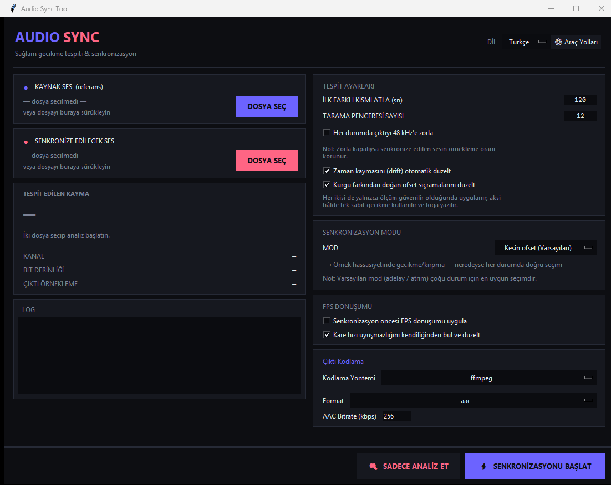

<div align="center">

# Audio Sync Tool

[](https://www.python.org/)
[](LICENSE)
[](https://github.com/blast1see/AudioSyncTool)
[](https://github.com/blast1see/AudioSyncTool/releases)

**A robust audio delay detection and synchronization tool with a modern dark-themed GUI.**

[English](#english) | [Türkçe](#turkce)

</div>

---

<!-- ============================================================ -->
<!-- ENGLISH                                                       -->
<!-- ============================================================ -->

<a id="english"></a>

## English

### About

**Audio Sync Tool** is a robust audio delay detection and synchronization tool with a modern dark-themed GUI. It analyzes two audio files, detects the time offset between them using cross-correlation, and produces a perfectly synchronized output. Whether you're dealing with out-of-sync dubs, misaligned audio tracks, or FPS-converted content, Audio Sync Tool handles it all with precision.

### Screenshot


### Key Features

The three corrections below exist because a single constant delay is not enough
for real material. Each is applied only when the measurement supports it, and
the log says which one ran.

- **Cross-correlation based delay detection** — robust & accurate offset calculation
- **Progressive drift correction** — cancels the clock difference between two sources, so a two-hour file stays in sync at the end as well as the start
- **Piecewise correction for different edits** — when the offset jumps partway through (an ad break, a reel change), the track is split at the edit and each region gets its own delay
- **Frame-rate mismatch detection** — recognises a dub mastered at the wrong rate, then converts and re-analyzes on its own
- **Honest confidence** — when the measured windows disagree with each other, it says so instead of handing you a file that only looks right
- **3 synchronization modes** — precise offset, timestamp repair, Rubber Band stretch
- **MKV/MP4 container support** — auto-detect and extract audio streams
- **Drag & drop file support** — seamless file loading with tkinterdnd2
- **AC3 and EAC3 encoding** — via FFmpeg or [deew](https://github.com/pcroland/deew)
- **AAC encoding** — via FFmpeg or [qaac](https://github.com/nu774/qaac) (Apple AAC)
- **FLAC & Opus encoding** — via FFmpeg
- **FPS conversion** — 23.976 <-> 24 <-> 25
- **Bilingual UI** — English / Turkish
- **Dark-themed modern interface** — fits a 1080p screen without scrolling
- **Preserves original audio quality** — bit depth, sample rate, channel order

### System Requirements

| Requirement | Details |
|---|---|
| **Python** | 3.10 or higher |
| **FFmpeg** | Required — must be in system PATH or set via Tool Paths |
| **deew** | Optional — for AC3 / EAC3 encoding |
| **qaac** | Optional — for Apple AAC encoding |

> **Note on tool lookup.** External tools are only searched for in absolute `PATH`
> directories. The folder the app happens to be launched from is deliberately
> excluded, so a stray `ffmpeg.exe` sitting next to your media files can never be
> executed in place of the installed one. If a tool lives outside `PATH`, point at
> it explicitly with **Tool Paths**.

### Installation

#### Option 1: Pre-built Windows Executable

Download the latest pre-built `.exe` from the [Releases](https://github.com/blast1see/AudioSyncTool/releases) page. No Python installation required.

#### Option 2: Run from Source

```bash
git clone https://github.com/blast1see/AudioSyncTool.git
cd AudioSyncTool
pip install -r requirements.txt
python -m audio_sync
```

#### Optional: Drag & Drop Support

```bash
pip install tkinterdnd2
```

> **Note:** `tkinterdnd2` enables drag & drop functionality in the GUI. The application works without it, but file selection will be limited to the file browser dialog.

#### Development and tests

```bash
python -m pip install -e ".[dev]"
python -m ruff check .
python -m compileall -q audio_sync tests
python -m pytest -m "not integration and not gui"
python -m pytest -m integration   # requires FFmpeg and FFprobe
```

Linux GUI smoke tests use `xvfb-run -a python -m pytest -m gui`. The CI matrix also
checks Python 3.10, 3.12, and 3.14 and builds the Windows executable with PyInstaller.

### Usage Guide

1. **Select Source Audio** — Click "Browse" or drag & drop the audio file that needs to be synchronized (the one with the delay).
2. **Select Sync Target** — Click "Browse" or drag & drop the reference audio file (the correctly timed one).
3. **Configure Settings:**
   - Choose the synchronization mode
   - Set output format and encoding options
   - Optionally enable Deew encoding or FPS conversion
4. **Start Sync** — Click the "Start Sync" button. The tool will analyze the delay and produce the synchronized output.

### Supported Formats

#### Audio Formats

| Format | Extension |
|---|---|
| Waveform Audio | `.wav` |
| MP3 | `.mp3` |
| FLAC | `.flac` |
| AAC | `.aac` |
| Ogg Vorbis | `.ogg` |
| MPEG-4 Audio | `.m4a` |
| AC3 | `.ac3` |
| EAC3 | `.eac3` |
| DTS | `.dts` |
| DTS-HD | `.dtshd` |
| TrueHD | `.thd` |
| Matroska Audio | `.mka` |
| Opus | `.opus` |
| Windows Media Audio | `.wma` |

#### Container Formats (audio extraction)

| Format | Extension |
|---|---|
| Matroska Video | `.mkv` |
| MPEG-4 Video | `.mp4` |
| MPEG-4 Video | `.m4v` |
| WebM | `.webm` |
| MPEG Transport Stream | `.ts` |
| MPEG Transport Stream | `.mts` |

### Synchronization Modes

| Mode | Description |
|---|---|
| **Precise offset** (default) | Sample-accurate `adelay` / `atrim` on the target track. Correct for almost every job — leave it alone unless one of the cases below applies. |
| **Repair timestamps** | Appends `aresample=async=1`. Only useful when the input's own timestamps are broken (stream captures, VFR remuxes); on a well-formed file it changes nothing. |
| **Rubber Band stretch** | Performs drift correction with librubberband instead of `atempo`. Engages only when a drift is actually being corrected, and needs FFmpeg built with `--enable-librubberband`. |

> **Changed in v2.4.** v2.3 offered six modes, but five of them produced
> byte-identical output — the extra filters were either absent or no-ops such as
> `rubberband=tempo=1.0`, which re-encoded the audio for no benefit. The list is
> now the three that genuinely behave differently. Code that names a retired
> mode (`ATEMPO`, `APAD`, `ASYNCTS`) keeps working: pass the name through
> `audio_sync.config.sync_mode_from_name()`, which maps each to the surviving
> mode that reproduces its old behaviour.

### Drift Correction

Two encodes of the same soundtrack often run at slightly different clock rates.
A constant delay cannot fix that: correcting the middle of the file leaves both
ends out of sync, and the error grows with runtime.

Audio Sync Tool fits a line through the per-window offsets it measures, and when
the slope is both large enough to matter and well supported by the data, it
retimes the target track to cancel it. On a five-minute test with 0.1 % drift
(~60 ms/min) this took the residual error from **228 ms of swing down to 7 ms**.

The correction is skipped — and the log says so — when the fit is weak (R² below
0.80), when fewer than six windows validated, when they span under a minute, or
when the slope is below 1 ms/min. In those cases only the constant offset is
applied, exactly as before. Turn the whole behaviour off with **Correct
progressive drift automatically** in Detection Settings.

### Offset Jumps (Different Edits)

Drift is a gradual slope; a *jump* is different. Broadcast and streaming dubs are
frequently cut differently from the disc — an ad break trimmed out, a reel change,
an alternate edit — which moves the offset by a fixed amount partway through and
leaves it there. Neither a constant delay nor a straight line can express that.

Audio Sync Tool models the offset piecewise. It looks for genuine steps in the
measured windows, then pins each boundary down by asking the audio directly:
given the two candidate offsets, whichever one aligns the tracks better at a
given moment says which side of the edit that moment is on, and bisecting on
that finds the cut within a few seconds. The track is then split at those points
and each region is aligned on its own delay, with a short fade across every join.

Measured on real material — a Turkish dub against the BluRay remux — this took a
two-hour film from **660 ms of error at worst down to 63 ms**, with the windows
exceeding 45 ms falling from 20 of 27 to 1 of 28.

Splicing only happens when the evidence supports it. The steps must clear 40 ms,
hold for at least two minutes on both sides, be backed by at least four
convincing windows each, stand at least 4x above the scatter the windows already
show, and explain the data clearly better than a straight line does — that last
test is what keeps a smooth drift from being chopped into a staircase. Turn it
off with **Correct offset jumps from different edits**.

> **Known limitation.** Drift and jumps are treated as alternatives, not as
> things that can coexist: whichever model explains the measurements better is
> the one applied. A track that both steps *and* drifts will have only the
> dominant effect corrected. None of the material tested so far does both, but
> if the log reports regions and the result still slides within one of them,
> that is the case you are looking at.

### Frame-Rate Mismatches

A dub mastered against a different frame rate plays at the wrong speed: 24 vs
23.976 drifts about 60 ms per minute, PAL against film speed about 2.5 seconds
per minute. Correcting that after the fact is possible but second-best, because
by the end of a feature the two tracks can be seconds apart — further than the
analysis window can follow, which is exactly when the measurement itself starts
to fail.

So the tool tests for it directly. The coarse feature stream is resampled by each
standard ratio and scored; if one explains the pair better than no conversion,
that ratio is named in the log. Across eight real film pairs it identified the
two that were mismatched and stayed silent on the other six.

You do not have to act on it yourself. When a mismatch is found, the tool
converts and re-analyzes on its own, then keeps that result only if the
validated windows agree more closely than they did without it — so a wrong guess
cannot make a correct pair worse, and the second pass only runs when something
was actually detected.

On the 132-minute pair above, that took the default-settings result from **4.0
seconds of error down to 352 ms**, with the windows exceeding 45 ms falling from
11 of 11 to 4 of 12 — with nothing asked of the user. Uncheck **Detect and
correct a frame-rate mismatch automatically** in the FPS panel to go back to
being told rather than helped.

### When The Result Cannot Be Trusted

A high confidence score means each window matched something convincingly. It
says nothing about whether the windows agree with *each other* — and that is
what decides whether one delay can hold across a whole film.

Audio Sync Tool now measures that disagreement and says so. When the validated
windows scatter by more than 100 ms, the log warns and the readout is marked
weak regardless of the score, because the reported delay is then only right for
whichever stretch of the film dominated the vote.

This happens when the two sources are not really the same edit, or when they
drift apart by more than the search can follow. Tested against a 132-minute
cross-language pair whose offset slid from +40.3 s to +32.5 s across the film,
the windows disagreed by 200 ms and the output was seconds out at the ends —
the tool will tell you that rather than hand you a file that looks fine.

If you hit this, the usual fixes are to confirm both tracks are the same cut,
or to sync the halves separately.

### Deew Encoding

Audio Sync Tool integrates with **[deew](https://github.com/pcroland/deew)** to provide AC3 and EAC3 encoding capabilities.

#### Requirements

- **[deew](https://github.com/pcroland/deew)** — install via `pip install deew`

#### How it works

1. Audio Sync Tool first synchronizes the audio using FFmpeg
2. The synchronized output is then passed to deew for AC3/EAC3 encoding
3. The final output is a properly encoded AC3 or EAC3 file

> **Important:** Please refer to the [deew documentation](https://github.com/pcroland/deew) for setup instructions.

> **If deew exits immediately on Windows,** check `logo` in its config. deew
> draws a start-up banner through `rich`, and on any locale whose code page
> cannot represent the block characters it uses — Turkish cp1254, Greek cp1253
> and others — that banner raises `UnicodeEncodeError` and deew dies before
> touching the audio. Setting `logo = 0` in `%LOCALAPPDATA%\deew\config.toml`
> fixes it, and costs nothing: the banner is decorative, and Audio Sync Tool
> captures deew's output anyway so you never see it. Audio Sync Tool recognises
> this crash and tells you the same thing rather than showing a traceback.

### Temporary Files

Every run writes intermediates the size of the film's audio — decoded PCM for the
analysis, a synchronized WAV, an FPS-converted WAV, deew's scratch directory. All
of it lives in a temporary folder beside the output and is removed when the run
ends, whether it succeeded, failed or was cancelled.

The one deliberate exception is a failure during the final *encoding* step. The
synchronization has already succeeded by then, so the synchronized WAV is kept
rather than making you analyze the film again. That file is uncompressed and as
long as the movie — several GB for a feature — so the error message tells you
where it is and how big it is. Delete it once you have what you need.

### FPS Conversion

Audio Sync Tool can compensate for frame rate differences between video sources. When audio is extracted from a video with a different frame rate than the target, the tool adjusts the audio duration accordingly.

Common conversions:
- 23.976 fps <-> 24 fps
- 23.976 fps <-> 25 fps (PAL <-> film speed-up / slow-down)
- 24 fps <-> 25 fps

### Building EXE

To build a standalone Windows executable:

```bash
python setup.py
```

This uses PyInstaller to create a single `.exe` file in the `dist/` directory.

### Project Structure

```
AudioSyncTool/
├── audio_sync.py            # Entry point
├── setup.py                 # PyInstaller build script
├── create_icon.py           # Icon generator
├── requirements.txt         # Python dependencies
├── LICENSE                  # MIT License
├── README.md                # Documentation (EN + TR)
├── CHANGELOG.md             # Version history
├── RELEASE_NOTES.md         # Release notes
├── audio_sync/
│   ├── __init__.py          # Package init & version
│   ├── __main__.py          # Module entry point
│   ├── config.py            # Configuration management
│   ├── i18n.py              # Internationalization (EN/TR)
│   ├── utils.py             # Utility functions
│   ├── core/
│   │   ├── __init__.py
│   │   ├── analyzer.py      # Audio analysis & cross-correlation
│   │   ├── encoder.py       # Unified encoding interface
│   │   ├── deew_encoder.py  # Deew encoding integration
│   │   ├── ffmpeg_wrapper.py# FFmpeg command builder
│   │   └── models.py        # Data models
│   └── ui/
│       ├── __init__.py
│       ├── app.py           # Main application window
│       ├── drop_zone.py     # Drag & drop widget
│       └── stream_dialog.py # Audio stream selection dialog
```

### Dependencies

#### Required

| Package | Purpose |
|---|---|
| **numpy** | Numerical operations for audio analysis |
| **scipy** | Cross-correlation and signal processing |
| **FFmpeg** | Audio decoding, encoding, and processing (system binary) |

#### Optional

| Package | Purpose |
|---|---|
| **tkinterdnd2** | Drag & drop support in the GUI |
| **deew** | AC3 / EAC3 encoding |
| **qaac** | Apple AAC encoding |

### Contributing

Contributions are welcome! Here's how you can help:

1. **Fork** the repository
2. **Create** a feature branch (`git checkout -b feature/amazing-feature`)
3. **Commit** your changes (`git commit -m 'Add amazing feature'`)
4. **Push** to the branch (`git push origin feature/amazing-feature`)
5. **Open** a Pull Request

Please make sure your code follows the existing style and includes appropriate documentation.

### License

This project is licensed under the **MIT License** — see the [LICENSE](LICENSE) file for details.

### Changelog

See [CHANGELOG.md](CHANGELOG.md) for a detailed list of changes in each version.

---

<!-- ============================================================ -->
<!-- TURKCE                                                        -->
<!-- ============================================================ -->

<a id="turkce"></a>

## Türkçe

### Hakkında

**Audio Sync Tool**, modern karanlık temalı bir arayüze sahip, sağlam bir ses gecikme tespiti ve senkronizasyon aracıdır. İki ses dosyasını analiz eder, aralarındaki zaman farkını çapraz korelasyon kullanarak tespit eder ve mükemmel şekilde senkronize edilmiş bir çıktı üretir. Senkronize olmayan dublajlar, hizalanmamış ses parçaları veya FPS dönüştürülmüş içeriklerle uğraşıyor olun, Audio Sync Tool hepsini hassasiyetle halleder.

### Ekran Görüntüsü



### Temel Özellikler

Aşağıdaki üç düzeltme, gerçek malzemede tek bir sabit gecikmenin yetmemesi
yüzünden var. Her biri yalnızca ölçüm destekliyorsa uygulanır ve hangisinin
çalıştığı loga yazılır.

- **Çapraz korelasyon tabanlı gecikme tespiti** — sağlam ve doğru ofset hesaplama
- **İlerleyen kayma (drift) düzeltmesi** — iki kaynak arasındaki saat farkını giderir; iki saatlik bir dosya sonunda da başındaki kadar senkron kalır
- **Farklı kurgular için parçalı düzeltme** — ofset filmin ortasında sıçrıyorsa (reklam arası, makara değişimi) parça kesme noktasından bölünür ve her bölge kendi gecikmesini alır
- **Kare hızı uyuşmazlığı tespiti** — yanlış hızda hazırlanmış bir dublajı tanır, kendisi dönüştürüp yeniden analiz eder
- **Dürüst güven bildirimi** — ölçülen pencereler birbiriyle uyuşmuyorsa bunu söyler; yalnızca düzgün görünen bir dosya vermez
- **3 senkronizasyon modu** — kesin ofset, zaman damgası onarımı, Rubber Band germe
- **MKV/MP4 konteyner desteği** — otomatik algılama ve ses akışı çıkarma
- **Sürükle & bırak dosya desteği** — tkinterdnd2 ile sorunsuz dosya yükleme
- **AC3 ve EAC3 kodlama** — FFmpeg veya [deew](https://github.com/pcroland/deew) aracılığıyla
- **AAC kodlama** — FFmpeg veya [qaac](https://github.com/nu774/qaac) (Apple AAC) aracılığıyla
- **FLAC & Opus kodlama** — FFmpeg aracılığıyla
- **FPS dönüşümü** — 23.976 <-> 24 <-> 25
- **İki dilli arayüz** — İngilizce / Türkçe
- **Karanlık temalı modern arayüz** — göz yormayan tasarım
- **Orijinal ses kalitesini korur** — bit derinliği, örnekleme hızı, kanal sayısı
- **Tool Paths** — ffmpeg, ffprobe, qaac, deew için isteğe bağlı özel yollar (yoksa sistem PATH'i kullanılır)

### Sistem Gereksinimleri

| Gereksinim | Detaylar |
|---|---|
| **Python** | 3.10 veya üzeri |
| **FFmpeg** | Gerekli — sistem PATH'inde bulunmalı veya Tool Paths ile ayarlanmalı |
| **deew** | İsteğe bağlı — AC3 / EAC3 kodlama için |
| **qaac** | İsteğe bağlı — Apple AAC kodlama için |

> **Araç araması hakkında not.** Dış araçlar yalnızca mutlak `PATH` dizinlerinde
> aranır. Uygulamanın başlatıldığı klasör bilinçli olarak dışarıda bırakılmıştır;
> böylece medya dosyalarınızın yanında duran başıboş bir `ffmpeg.exe`, kurulu olanın
> yerine asla çalıştırılamaz. Bir araç `PATH` dışındaysa **Tool Paths** ile doğrudan
> yolunu belirtin.

### Kurulum

#### Seçenek 1: Hazır Windows Çalıştırılabilir Dosyası

[Releases](https://github.com/blast1see/AudioSyncTool/releases) sayfasından en son `.exe` dosyasını indirin. Python kurulumu gerekmez.

#### Seçenek 2: Kaynak Koddan Çalıştırma

```bash
git clone https://github.com/blast1see/AudioSyncTool.git
cd AudioSyncTool
pip install -r requirements.txt
python -m audio_sync
```

#### İsteğe Bağlı: Sürükle & Bırak Desteği

```bash
pip install tkinterdnd2
```

> **Not:** `tkinterdnd2`, arayüzde sürükle & bırak işlevselliğini etkinleştirir. Uygulama bu paket olmadan da çalışır, ancak dosya seçimi yalnızca dosya tarayıcı diyalogu ile sınırlı kalır.

#### Geliştirme ve testler

```bash
python -m pip install -e ".[dev]"
python -m ruff check .
python -m compileall -q audio_sync tests
python -m pytest -m "not integration and not gui"
python -m pytest -m integration   # FFmpeg ve FFprobe gerektirir
```

Linux GUI smoke testleri `xvfb-run -a python -m pytest -m gui` ile çalışır. CI matrisi
ayrıca Python 3.10, 3.12 ve 3.14'ü kontrol eder ve PyInstaller ile Windows EXE'sini üretir.

### Kullanım Kılavuzu

1. **Kaynak Sesi Seçin** — "Gözat" düğmesine tıklayın veya senkronize edilmesi gereken ses dosyasını (gecikmeli olan) sürükleyip bırakın.
2. **Senkronizasyon Hedefini Seçin** — "Gözat" düğmesine tıklayın veya referans ses dosyasını (doğru zamanlamalı olan) sürükleyip bırakın.
3. **Ayarları Yapılandırın:**
   - Senkronizasyon modunu seçin
   - Çıktı formatını ve kodlama seçeneklerini ayarlayın
   - İsteğe bağlı olarak Deew kodlama veya FPS dönüşümünü etkinleştirin
4. **Senkronizasyonu Başlatın** — "Senkronizasyonu Başlat" düğmesine tıklayın. Araç gecikmeyi analiz edecek ve senkronize edilmiş çıktıyı üretecektir.

### Desteklenen Formatlar

#### Ses Formatları

| Format | Uzantı |
|---|---|
| Waveform Audio | `.wav` |
| MP3 | `.mp3` |
| FLAC | `.flac` |
| AAC | `.aac` |
| Ogg Vorbis | `.ogg` |
| MPEG-4 Audio | `.m4a` |
| AC3 | `.ac3` |
| EAC3 | `.eac3` |
| DTS | `.dts` |
| DTS-HD | `.dtshd` |
| TrueHD | `.thd` |
| Matroska Audio | `.mka` |
| Opus | `.opus` |
| Windows Media Audio | `.wma` |

#### Konteyner Formatları (ses çıkarma)

| Format | Uzantı |
|---|---|
| Matroska Video | `.mkv` |
| MPEG-4 Video | `.mp4` |
| MPEG-4 Video | `.m4v` |
| WebM | `.webm` |
| MPEG Transport Stream | `.ts` |
| MPEG Transport Stream | `.mts` |

### Senkronizasyon Modları

| Mod | Açıklama |
|---|---|
| **Kesin ofset** (varsayılan) | Hedef parçaya örnek hassasiyetinde `adelay` / `atrim` uygular. Neredeyse her iş için doğru seçim — aşağıdaki özel durumlar yoksa değiştirmeyin. |
| **Zaman damgası onarımı** | Sona `aresample=async=1` ekler. Yalnızca girdinin kendi zaman damgaları bozuksa (yayın kaydı, VFR remux) işe yarar; düzgün bir dosyada hiçbir şeyi değiştirmez. |
| **Rubber Band germe** | Drift düzeltmesini `atempo` yerine librubberband ile yapar. Yalnızca gerçekten bir drift düzeltilirken devreye girer ve FFmpeg'in `--enable-librubberband` ile derlenmiş olmasını gerektirir. |

> **v2.4'te değişti.** v2.3'te altı mod vardı ama beşi bayt bayt aynı çıktıyı
> üretiyordu: ek filtreler ya hiç eklenmiyor ya da `rubberband=tempo=1.0` gibi
> sesi boş yere yeniden kodlayan işlevsiz aşamalardı. Liste artık gerçekten
> farklı davranan üç moddan oluşuyor. Emekliye ayrılan adları (`ATEMPO`,
> `APAD`, `ASYNCTS`) kullanan kodlar çalışmaya devam eder: adı
> `audio_sync.config.sync_mode_from_name()` üzerinden geçirin, her biri eski
> davranışını yeniden üreten moda eşlenir.

### Drift Düzeltmesi

Aynı ses bandının iki farklı kodlaması çoğu zaman birbirinden hafifçe farklı
saat hızlarıyla ilerler. Sabit bir gecikme bunu düzeltemez: dosyanın ortasını
hizalayınca iki uç kayar ve hata süre uzadıkça büyür.

Audio Sync Tool ölçtüğü pencere ofsetlerine bir doğru uydurur; eğim hem anlamlı
büyüklükte hem de verice yeterince desteklenirse hedef parçayı yeniden
zamanlayarak bunu giderir. %0,1 drift içeren (yaklaşık 60 ms/dk) beş dakikalık
bir testte kalıntı hata **228 ms salınımdan 7 ms'ye** düştü.

Uyum zayıfsa (R² 0,80 altında), altıdan az pencere doğrulanmışsa, pencereler bir
dakikadan kısa bir aralığa yayılmışsa ya da eğim 1 ms/dk altındaysa düzeltme
uygulanmaz ve bu durum loga yazılır. O hâlde eskisi gibi yalnızca sabit ofset
uygulanır. Davranışı tümüyle kapatmak için Tespit Ayarları'ndaki **Zaman
kaymasını (drift) otomatik düzelt** kutusunu kaldırın.

### Ofset Sıçramaları (Farklı Kurgular)

Drift kademeli bir eğimdir; *sıçrama* ise başka bir şeydir. Yayın ve dijital
platform dublajları çoğu zaman diskten farklı kurgulanır — çıkarılmış bir reklam
arası, makara değişimi, alternatif bir kurgu — ve bu, ofseti filmin ortasında
sabit bir miktar kaydırıp orada bırakır. Ne sabit gecikme ne de doğru bunu
ifade edebilir.

Audio Sync Tool ofseti parça parça modeller. Önce ölçülen pencerelerde gerçek
basamakları arar, sonra her sınırı doğrudan sese sorarak yerine oturtur: iki aday
ofsetten hangisi belirli bir anda parçaları daha iyi hizalıyorsa, o an kesmenin
hangi tarafında olduğumuzu söyler; bu ölçüt üzerinde ikili arama kesmeyi birkaç
saniye içinde bulur. Parça bu noktalardan bölünür, her bölge kendi gecikmesiyle
hizalanır ve her ek yerine kısa bir sönümleme uygulanır.

Gerçek malzemede ölçüldü — BluRay remux'a karşı bir Türkçe dublaj: iki saatlik
bir filmde en kötü hata **660 ms'den 63 ms'ye** düştü, 45 ms'yi aşan pencere
sayısı 27'de 20'den 28'de 1'e indi.

Kesme yalnızca kanıt destekliyorsa yapılır. Basamak 40 ms'yi aşmalı, iki tarafta
da en az iki dakika sürmeli, her biri en az dört ikna edici pencereyle
desteklenmeli, pencerelerin kendi saçılmasının en az 4 katı olmalı ve veriyi bir
doğrudan belirgin biçimde daha iyi açıklamalıdır — bu son sınama, düzgün bir
driftin merdivene doğranmasını engelleyen şeydir. Kapatmak için **Kurgu
farkından doğan ofset sıçramalarını düzelt** kutusunu kaldırın.

> **Bilinen sınır.** Drift ve sıçrama birlikte var olabilen şeyler olarak değil,
> alternatif olarak ele alınır: ölçümleri hangisi daha iyi açıklıyorsa o
> uygulanır. Hem basamaklanan hem de kayan bir parçada yalnızca baskın etki
> düzeltilir. Şimdiye kadar denenen malzemelerin hiçbirinde ikisi bir arada
> görülmedi; ancak log bölgeleri bildiriyor ve sonuç bir bölgenin içinde hâlâ
> kayıyorsa karşılaştığınız durum budur.

### Kare Hızı Uyuşmazlıkları

Farklı bir kare hızına göre hazırlanmış bir dublaj yanlış hızda çalar: 24'e
karşı 23.976 dakikada yaklaşık 60 ms, PAL'e karşı film hızı ise dakikada
yaklaşık 2,5 saniye kayar. Bunu sonradan düzeltmek mümkündür ama ikinci en iyi
çözümdür; çünkü bir uzun metrajın sonunda iki parça saniyelerce ayrışmış olur —
analiz penceresinin izleyebileceğinden daha fazla, ki ölçümün kendisi de tam
bu noktada bozulmaya başlar.

Bu yüzden araç doğrudan sınıyor. Kaba öznitelik akışı standart oranların her
biriyle yeniden örneklenip skorlanıyor; biri dönüşümsüz duruma göre çifti daha
iyi açıklıyorsa o oran loga yazılıyor. Sekiz gerçek film çiftinde uyuşmazlığı
olan ikisini buldu, diğer altısında sessiz kaldı.

Bunu elle yapmanız gerekmiyor. Bir uyuşmazlık bulunduğunda araç kendisi
dönüştürüp yeniden analiz eder ve sonucu yalnızca doğrulanan pencereler
öncekinden daha uyumlu çıkarsa saklar — yani yanlış bir tahmin, doğru bir çifti
bozamaz; ikinci geçiş de yalnızca gerçekten bir şey tespit edildiğinde çalışır.

Yukarıdaki 132 dakikalık çiftte bu, varsayılan ayarlarla alınan sonucu **4,0
saniyelik hatadan 352 ms'ye** indirdi; 45 ms'yi aşan pencere sayısı 11'de 11'den
12'de 4'e düştü — kullanıcıdan hiçbir şey istenmeden. Yardım almak yerine
yalnızca bilgilendirilmek isterseniz FPS panelindeki **Kare hızı uyuşmazlığını
kendiliğinden bul ve düzelt** kutusunu kaldırın.

### Sonuca Ne Zaman Güvenilmez

Yüksek bir güven skoru, her pencerenin bir şeye ikna edici biçimde eşleştiğini
söyler. Pencerelerin *birbiriyle* uyuşup uyuşmadığı hakkında hiçbir şey
söylemez — oysa tek bir gecikmenin tüm filmde geçerli olup olmayacağını
belirleyen budur.

Audio Sync Tool artık bu uyuşmazlığı ölçüyor ve bildiriyor. Doğrulanan
pencereler 100 ms'den fazla ayrışıyorsa log uyarır ve skor ne olursa olsun
okuma "zayıf" olarak işaretlenir; çünkü bildirilen gecikme yalnızca oylamada
baskın çıkan bölüm için doğrudur.

Bu, iki kaynak aslında aynı kurgu olmadığında ya da aramanın izleyebileceğinden
daha fazla birbirinden uzaklaştığında olur. Ofseti film boyunca +40,3 s'den
+32,5 s'ye kayan 132 dakikalık iki dilli bir çiftte pencereler 200 ms ayrıştı ve
çıktı uçlarda saniyelerce kaymıştı — araç size düzgün görünen bir dosya vermek
yerine bunu söyleyecek.

Bununla karşılaşırsanız olağan çözüm, iki parçanın aynı kurgu olduğunu
doğrulamak veya yarımları ayrı ayrı senkronlamaktır.

### Deew Kodlama

Audio Sync Tool, AC3 ve EAC3 kodlama yetenekleri sağlamak için **[deew](https://github.com/pcroland/deew)** ile entegre çalışır.

#### Gereksinimler

- **[deew](https://github.com/pcroland/deew)** — `pip install deew` ile kurulabilir

#### Nasıl Çalışır

1. Audio Sync Tool önce FFmpeg kullanarak sesi senkronize eder
2. Senkronize edilmiş çıktı daha sonra AC3/EAC3 kodlama için deew'e aktarılır
3. Son çıktı, düzgün şekilde kodlanmış bir AC3 veya EAC3 dosyasıdır

> **Önemli:** Kurulum talimatları için lütfen [deew dokümantasyonuna](https://github.com/pcroland/deew) başvurun.

> **deew Windows'ta hemen çıkıyorsa,** yapılandırmasındaki `logo` ayarına bakın.
> deew açılışta `rich` ile bir başlık çiziyor; bu başlığın kullandığı blok
> karakterleri temsil edemeyen kod sayfalarında — Türkçe cp1254, Yunanca cp1253
> ve diğerleri — `UnicodeEncodeError` fırlatıyor ve deew sese hiç dokunmadan
> ölüyor. `%LOCALAPPDATA%\deew\config.toml` içinde `logo = 0` yapmak sorunu
> çözer ve hiçbir şeye mal olmaz: başlık yalnızca süstür, üstelik Audio Sync
> Tool deew'in çıktısını yakaladığı için onu zaten görmezsiniz. Audio Sync Tool
> bu çökmeyi tanır ve traceback göstermek yerine aynı şeyi söyler.

### Geçici Dosyalar

Her çalıştırma, filmin sesi boyutunda ara dosyalar yazar — analiz için çözülmüş
PCM, senkronize edilmiş WAV, FPS dönüştürülmüş WAV, deew'in geçici dizini.
Bunların tamamı çıktının yanındaki geçici bir klasörde durur ve çalışma
bittiğinde — başarılı olsun, başarısız olsun, iptal edilsin — silinir.

Tek bilinçli istisna, son *kodlama* adımındaki bir hatadır. O noktada
senkronizasyon zaten başarılı olmuştur; bu yüzden filmi baştan analiz etmek
zorunda kalmayasınız diye senkronize WAV saklanır. Bu dosya sıkıştırılmamıştır
ve film uzunluğundadır — uzun metrajda birkaç GB — bu nedenle hata mesajı hem
nerede olduğunu hem de boyutunu söyler. İhtiyacınız kalmayınca silin.

### FPS Dönüşümü

Audio Sync Tool, video kaynakları arasındaki kare hızı farklılıklarını telafi edebilir. Ses, hedeften farklı bir kare hızına sahip bir videodan çıkarıldığında, araç ses süresini buna göre ayarlar.

Yaygın dönüşümler:
- 23.976 fps <-> 24 fps
- 23.976 fps <-> 25 fps (PAL <-> film hizlandirma / yavaslatma)
- 24 fps <-> 25 fps

### EXE Derleme

Bağımsız bir Windows çalıştırılabilir dosyası oluşturmak için:

```bash
python setup.py
```

Bu komut, PyInstaller kullanarak `dist/` dizininde tek bir `.exe` dosyası oluşturur.

### Proje Yapısı

```
AudioSyncTool/
├── audio_sync.py            # Giriş noktası
├── setup.py                 # PyInstaller derleme betiği
├── create_icon.py           # İkon oluşturucu
├── requirements.txt         # Python bağımlılıkları
├── LICENSE                  # MIT Lisansı
├── README.md                # Dokümantasyon (EN + TR)
├── CHANGELOG.md             # Sürüm geçmişi
├── RELEASE_NOTES.md         # Sürüm notları
├── audio_sync/
│   ├── __init__.py          # Paket başlatma & sürüm
│   ├── __main__.py          # Modül giriş noktası
│   ├── config.py            # Yapılandırma yönetimi
│   ├── i18n.py              # Uluslararasılaştırma (EN/TR)
│   ├── utils.py             # Yardımcı fonksiyonlar
│   ├── core/
│   │   ├── __init__.py
│   │   ├── analyzer.py      # Ses analizi & çapraz korelasyon
│   │   ├── encoder.py       # Birleşik kodlama arayüzü
│   │   ├── deew_encoder.py  # Deew kodlama entegrasyonu
│   │   ├── ffmpeg_wrapper.py# FFmpeg komut oluşturucu
│   │   └── models.py        # Veri modelleri
│   └── ui/
│       ├── __init__.py
│       ├── app.py           # Ana uygulama penceresi
│       ├── drop_zone.py     # Sürükle & bırak bileşeni
│       └── stream_dialog.py # Ses akışı seçim diyalogu
```

### Bağımlılıklar

#### Gerekli

| Paket | Amaç |
|---|---|
| **numpy** | Ses analizi için sayısal işlemler |
| **scipy** | Çapraz korelasyon ve sinyal işleme |
| **FFmpeg** | Ses çözme, kodlama ve işleme (sistem ikili dosyası) |

#### İsteğe Bağlı

| Paket | Amaç |
|---|---|
| **tkinterdnd2** | Arayüzde sürükle & bırak desteği |
| **deew** | AC3 / EAC3 kodlama |
| **qaac** | Apple AAC kodlama |

### Katkıda Bulunma

Katkılarınızı bekliyoruz! İşte nasıl yardımcı olabilirsiniz:

1. Depoyu **fork** edin
2. Bir özellik dalı **oluşturun** (`git checkout -b feature/harika-ozellik`)
3. Değişikliklerinizi **commit** edin (`git commit -m 'Harika ozellik ekle'`)
4. Dalı **push** edin (`git push origin feature/harika-ozellik`)
5. Bir **Pull Request** açın

Lütfen kodunuzun mevcut stile uygun olduğundan ve uygun dokümantasyon içerdiğinden emin olun.

### Lisans

Bu proje **MIT Lisansı** altında lisanslanmıştır — detaylar için [LICENSE](LICENSE) dosyasına bakın.

### Değişiklik Günlüğü

Her sürümdeki değişikliklerin detaylı listesi için [CHANGELOG.md](CHANGELOG.md) dosyasına bakın.

---

<div align="center">

Made with love by [blast1see](https://github.com/blast1see)

</div>
